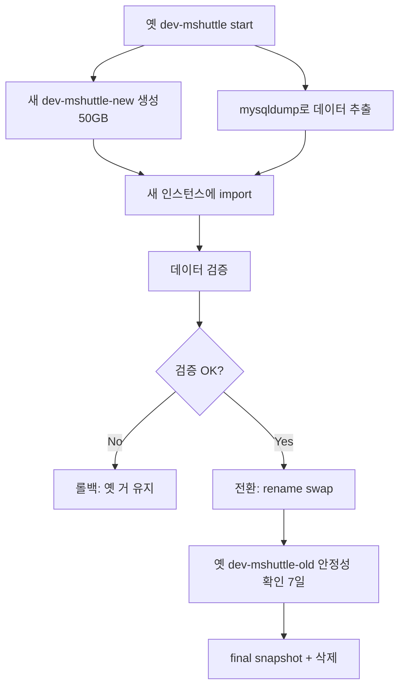

# dev-mshuttle RDS Storage 축소 마이그레이션 가이드

## 목적

dev-mshuttle RDS의 storage를 **200 GB → 50 GB**로 줄여 월 **~$13** 비용 절감.

RDS는 storage 증가만 가능하고 축소는 불가능. 따라서 작은 storage의 새 인스턴스를 만들어 데이터를 옮기는 방식.

## 현재 상태 (2026-06-01 기준)

| 항목 | 값 |
|------|------|
| Engine | MySQL 8.4.9 |
| Class | db.t4g.small |
| Storage | **200 GB gp3** (실제 사용 12.5 GB, 낭비율 94%) |
| AZ / Multi-AZ | ap-northeast-2c / **단일 AZ** |
| Master user | admin |
| Endpoint | dev-mshuttle.cpbnujantp4n.ap-northeast-2.rds.amazonaws.com:3306 |
| Subnet Group | default |
| Parameter Group | params-dev-mysql84 (커스텀) |
| Option Group | default:mysql-8-4 |
| Security Group | sg-a8fee9c1 (default) |
| Backup Retention | 7일 |
| Backup Window | 20:06~20:36 UTC (= 05:06~05:36 KST) |
| Maintenance | 화 17:02~17:32 UTC (= 수 02:02~02:32 KST) |
| Publicly Accessible | true |
| Storage Encryption | KMS CMK `226af992-4a4b-4c82-842a-d75bd61fb2c8` |
| 현재 상태 | stopped |

## 비용 효과

| 항목 | 변경 전 | 변경 후 | 절감 |
|------|------|------|------|
| Storage 200GB gp3 | ~$18/월 | ~$5/월 (50GB) | -$13/월 |
| 인스턴스 시간 | start된 시간만 부과 | 동일 | 변동 없음 |
| 연간 효과 | | | **-$156/년** |

> 별도 비용: final snapshot 보관(보관 기간 동안 ~$10/월), 일정 기간 후 정리.

---

## 마이그레이션 흐름



---

## 사전 준비

### 1. 작업 도구
- mysqldump, mysql 클라이언트 (MySQL 8.x)
- 작업 위치: mshuttle EC2 (같은 VPC, RDS와 통신 빠름) 또는 로컬
- mshuttle EC2 사용 권장 (방화벽 통과 / 네트워크 안정)

### 2. master 비밀번호 확보
AWS Secrets Manager에 저장되어 있다면:
```bash
aws secretsmanager get-secret-value --region ap-northeast-2 --secret-id <ARN> --query SecretString
```

저장된 게 없다면 다음 단계의 modify로 비밀번호 재설정 필요.

### 3. 백업 보관 공간
- dump 파일 ~12.5 GB + 압축 시 ~2~3 GB
- mshuttle EC2의 EBS 여유 공간 충분 (20GB 중 사용 12.5GB 외 여유)

---

## 단계별 절차

### Step 1. 옛 인스턴스 start

```bash
REGION=ap-northeast-2

aws rds start-db-instance --region $REGION --db-instance-identifier dev-mshuttle
aws rds wait db-instance-available --region $REGION --db-instance-identifier dev-mshuttle
```

### Step 2. 새 인스턴스 생성 (50 GB)

옛 인스턴스와 동일 설정 + storage만 50GB. **이름은 `dev-mshuttle-new`**.

```bash
aws rds create-db-instance --region $REGION \
  --db-instance-identifier dev-mshuttle-new \
  --db-instance-class db.t4g.small \
  --engine mysql --engine-version 8.4.9 \
  --license-model general-public-license \
  --master-username admin \
  --master-user-password '<임시 비밀번호>' \
  --allocated-storage 50 --storage-type gp3 \
  --storage-encrypted \
  --kms-key-id arn:aws:kms:ap-northeast-2:306331009209:key/226af992-4a4b-4c82-842a-d75bd61fb2c8 \
  --vpc-security-group-ids sg-a8fee9c1 \
  --db-subnet-group-name default \
  --db-parameter-group-name params-dev-mysql84 \
  --option-group-name default:mysql-8-4 \
  --availability-zone ap-northeast-2c \
  --no-multi-az \
  --backup-retention-period 7 \
  --preferred-backup-window 20:06-20:36 \
  --preferred-maintenance-window tue:17:02-tue:17:32 \
  --publicly-accessible \
  --no-deletion-protection \
  --tags Key=Purpose,Value=dev-migration-target Key=ReplacesFor,Value=dev-mshuttle

aws rds wait db-instance-available --region $REGION --db-instance-identifier dev-mshuttle-new
```

> **권장**: `params-dev-mysql84` 파라미터 그룹을 양쪽에서 공유해도 되지만, 변경이 발생하면 양쪽이 동시에 영향받음. 새 그룹을 복제해 쓰는 게 깔끔.
> ```bash
> aws rds copy-db-parameter-group --region $REGION \
>   --source-db-parameter-group-identifier params-dev-mysql84 \
>   --target-db-parameter-group-identifier params-dev-mysql84-new \
>   --target-db-parameter-group-description "Copy for dev-mshuttle migration"
> ```

### Step 3. mysqldump로 데이터 추출

mshuttle EC2에서 (또는 로컬에서) 실행:

```bash
OLD_HOST=dev-mshuttle.cpbnujantp4n.ap-northeast-2.rds.amazonaws.com
ADMIN_PW='<옛 master 비밀번호>'
DUMP=/tmp/dev-mshuttle-dump.sql.gz

# 사용자 DB 목록 확인 (system DB 제외)
mysql -h $OLD_HOST -u admin -p"$ADMIN_PW" \
  -e "SHOW DATABASES;" \
  | grep -Ev "Database|information_schema|mysql|performance_schema|sys"

# 사용자 DB만 추출 (위 결과로 DB 이름 채워서)
mysqldump -h $OLD_HOST -u admin -p"$ADMIN_PW" \
  --single-transaction --routines --triggers --events \
  --set-gtid-purged=OFF \
  --databases <db1> <db2> ... \
  | gzip > $DUMP

ls -lh $DUMP
```

**옵션 설명**:
- `--single-transaction`: InnoDB consistent snapshot, 무락
- `--routines --triggers --events`: stored procedure / trigger / event 포함
- `--set-gtid-purged=OFF`: RDS 간 import 시 호환성
- `--databases`: 사용자 DB만 (mysql, sys 등 시스템 DB 제외)

### Step 4. 새 인스턴스에 import

```bash
NEW_HOST=dev-mshuttle-new.cpbnujantp4n.ap-northeast-2.rds.amazonaws.com
NEW_PW='<Step 2에서 정한 임시 비밀번호>'

gunzip < $DUMP | mysql -h $NEW_HOST -u admin -p"$NEW_PW"
```

import 시간: 12.5 GB 기준 약 10~20분.

### Step 5. 검증

```bash
# 5-1. 테이블 개수 비교 (각 DB별)
for DB in <db1> <db2> ...; do
  OLD=$(mysql -h $OLD_HOST -u admin -p"$ADMIN_PW" -N -e "SELECT COUNT(*) FROM information_schema.tables WHERE table_schema='$DB'")
  NEW=$(mysql -h $NEW_HOST -u admin -p"$NEW_PW"  -N -e "SELECT COUNT(*) FROM information_schema.tables WHERE table_schema='$DB'")
  echo "$DB  old=$OLD  new=$NEW"
done

# 5-2. row count 비교 (큰 테이블 위주)
mysql -h $OLD_HOST -u admin -p"$ADMIN_PW" -e "
  SELECT table_schema, table_name, table_rows
  FROM information_schema.tables
  WHERE table_schema NOT IN ('information_schema','mysql','performance_schema','sys')
  ORDER BY table_rows DESC LIMIT 20;
"
# 같은 query를 새 인스턴스에서도 실행해 결과 비교

# 5-3. routine/trigger 개수
mysql -h $OLD_HOST -u admin -p"$ADMIN_PW" -e "SELECT COUNT(*) FROM information_schema.routines;"
mysql -h $NEW_HOST -u admin -p"$NEW_PW"  -e "SELECT COUNT(*) FROM information_schema.routines;"

# 5-4. 사용자 연결 점검 (애플리케이션이 연결되는지 mshuttle EC2에서 dryrun)
mysql -h $NEW_HOST -u admin -p"$NEW_PW" -e "SELECT VERSION();"
```

검증 OK가 아니면 **Step 8 롤백**으로.

### Step 6. master 비밀번호 일치시키기 (옛 거와 동일하게)

애플리케이션 설정 변경 없이 전환하려면 master 비밀번호를 옛 것과 같게 맞춰야 함:

```bash
aws rds modify-db-instance --region $REGION \
  --db-instance-identifier dev-mshuttle-new \
  --master-user-password '<옛 admin 비밀번호>' \
  --apply-immediately

aws rds wait db-instance-available --region $REGION --db-instance-identifier dev-mshuttle-new
```

### Step 7. 전환 (rename swap)

⚠️ 이 단계 중 DB 접근 불가 시간 발생 가능 (~5분). 사용 안 하는 시점에 진행.

```bash
# 7-1. 옛 거 rename: dev-mshuttle → dev-mshuttle-old
aws rds modify-db-instance --region $REGION \
  --db-instance-identifier dev-mshuttle \
  --new-db-instance-identifier dev-mshuttle-old \
  --apply-immediately

aws rds wait db-instance-available --region $REGION --db-instance-identifier dev-mshuttle-old

# 7-2. 새 거 rename: dev-mshuttle-new → dev-mshuttle
aws rds modify-db-instance --region $REGION \
  --db-instance-identifier dev-mshuttle-new \
  --new-db-instance-identifier dev-mshuttle \
  --apply-immediately

aws rds wait db-instance-available --region $REGION --db-instance-identifier dev-mshuttle
```

rename 후 endpoint DNS는 동일 (`dev-mshuttle.cpbnujantp4n.ap-northeast-2.rds.amazonaws.com`)이지만 실제 IP는 새 인스턴스 IP로 바뀜. DNS TTL ~60초 이내 자동 전환.

### Step 8. 옛 인스턴스 final snapshot + 삭제

전환 후 7일 정도 안정성 검증 → 옛 인스턴스 최종 정리:

```bash
# 7일 후 검증 OK면
aws rds delete-db-instance --region $REGION \
  --db-instance-identifier dev-mshuttle-old \
  --final-db-snapshot-identifier dev-mshuttle-final-2026-06 \
  --no-skip-final-snapshot
```

`final-db-snapshot-identifier`의 스냅샷은 storage 사이즈만큼 ~$10/월 보관 비용 발생. **일정 기간 후 직접 삭제 필요**:

```bash
# 보관 6개월 후 정도
aws rds delete-db-snapshot --region $REGION --db-snapshot-identifier dev-mshuttle-final-2026-06
```

---

## 롤백 시나리오

검증 실패 또는 전환 후 문제 발견:

```bash
# 새 거를 다시 dev-mshuttle-new로 되돌리고
aws rds modify-db-instance --region $REGION \
  --db-instance-identifier dev-mshuttle \
  --new-db-instance-identifier dev-mshuttle-bad \
  --apply-immediately

# 옛 거를 원래 이름으로 복귀
aws rds modify-db-instance --region $REGION \
  --db-instance-identifier dev-mshuttle-old \
  --new-db-instance-identifier dev-mshuttle \
  --apply-immediately
```

이후 dev-mshuttle-bad는 원인 분석 후 삭제.

---

## 예상 시간

| 단계 | 시간 |
|------|------|
| Step 1. start | 5~10분 |
| Step 2. 새 인스턴스 생성 | 10~15분 |
| Step 3. dump | 5~10분 |
| Step 4. import | 10~20분 |
| Step 5. 검증 | 30분 |
| Step 6. 비밀번호 | 5분 |
| Step 7. rename swap | 5~10분 |
| **합계** | **약 1~2시간** |

---

## 체크리스트

작업 진행 시 순서대로 체크:

- [ ] 옛 인스턴스의 master 비밀번호 확보
- [ ] 사용자 DB 이름 목록 작성 (system DB 제외)
- [ ] mshuttle EC2(또는 로컬)에서 RDS endpoint 접근 가능 확인
- [ ] dump 공간 충분 확인 (`df -h`)
- [ ] Step 1: dev-mshuttle start
- [ ] Step 2: dev-mshuttle-new 생성
- [ ] Step 3: mysqldump 추출
- [ ] Step 4: import
- [ ] Step 5: 테이블 수 / row count / routine 수 검증
- [ ] Step 6: master 비밀번호 동기화
- [ ] Step 7: rename swap (사용 안 하는 시점)
- [ ] (7일 후) Step 8: dev-mshuttle-old final snapshot + 삭제
- [ ] (6개월 후) final snapshot 정리

---

## 주의사항

- **이 가이드는 stopped 상태의 dev DB 기준.** 운영 DB에 적용 시 무중단 마이그레이션(DMS, blue-green deployment) 검토 필요.
- **자동 스냅샷 17개**가 옛 dev-mshuttle에 묶여있음. 옛 인스턴스 삭제 시 자동 스냅샷도 정리 옵션 제공됨.
- **Parameter Group `params-dev-mysql84`**는 커스텀 그룹. 변경 사항이 있다면 새 인스턴스에도 그대로 반영되어야 동작 보장.
- **Security Group `sg-a8fee9c1`(default) + PubliclyAccessible: true는 옛 인스턴스 설정 그대로 유지.** 새 인스턴스에서 SG를 좁히거나 public 접근을 막으려면 사용자 명시 지시 후 진행. 위 Step 2 명령은 기존 설정과 동일하게 작성되어 있음.
