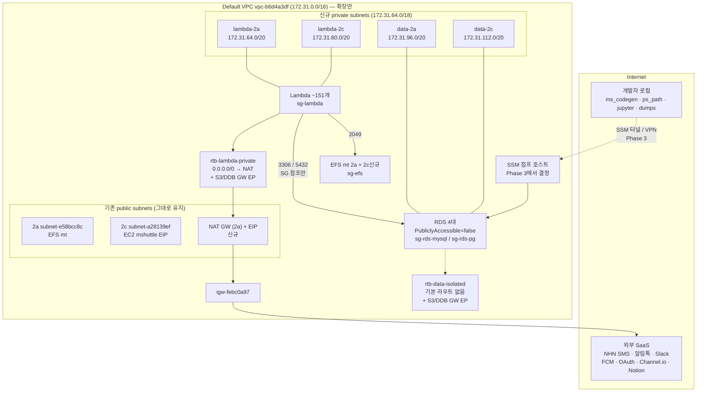

# 2026-07-30 · RDS 완전 사설화 설계 (Phase 0 착수 승인 대기)

RDS 4대가 인터넷에 노출된 상태를 사설망으로 옮기기 위한 설계. **조사·설계만 완료, AWS 변경 없음.**

---

## 1) 배경

2026-07-30 계정 점검에서 발견:

- RDS 4대 전부 `PubliclyAccessible=true`, 보안그룹에 3306/5432가 `0.0.0.0/0`
- GuardDuty가 최근 10일간 악성 IP의 **실제 포트 스캔 6건** 탐지 (`Discovery:RDS/MaliciousIPCaller`, 07-20·23·24·26·28·29, 대상 `spd-test`·`dev-mshuttle`). 인증 시도까지는 가지 않음
- Security Hub도 4대 전부 HIGH로 플래그 (`RDS DB instances should not be deployed in public subnets with routes to internet gateways`)

**과거 시도의 흔적:** RDS 서브넷그룹 `staging_db_subnet_group`이 VPC `vpc-03d4378f08d6d90dc`를 가리키는데, 그 VPC는 `InvalidVpcID.NotFound`다. 과거에 커스텀 VPC를 만들었다가 지운 잔재로 보인다. 위키에 관련 기록은 없다.

---

## 2) 현황 조사 결과

### 2-1. 네트워크

| 항목 | 현황 |
|---|---|
| VPC | Default `vpc-b6d4a3df` (172.31.0.0/16) **1개뿐**. 커스텀 VPC 0건 |
| 서브넷 | 4개 (2a `subnet-e58bcc8c`, 2b `subnet-ea16de91`, 2c `subnet-a28139ef`, 2d `subnet-6756063b`). **전부 `MapPublicIpOnLaunch=true`**, 명시적 RT 연결 0건 |
| 라우트테이블 | `rtb-ce5712a7` **1개뿐** (Main). `0.0.0.0/0 → igw-febc0a97` — 4개 서브넷 전부 암묵 연결 |
| private subnet | **0개** |
| NAT Gateway | **0건** |
| Interface VPC Endpoint | **0건** |
| Gateway VPC Endpoint | 2건 — `vpce-04594c2705ea64469`(S3), `vpce-0c15fbf4170e3d5e5`(DynamoDB). 둘 다 무료, 정책 full open |
| NACL | default `acl-569be03f` 1개, in/out 전부 allow — 방화벽 역할 없음 |
| VPC Flow Logs | **꺼져 있음 (0건)** |
| 로드밸런서 / ElastiCache / RDS Proxy / DMS | 전부 0건 |
| 여유 CIDR | `172.31.64.0/18` 대역이 통째로 비어 있음 |

### 2-2. VPC 안에 실제로 사는 것 (ENI 8개가 진실)

| 리소스 | 위치 | 비고 |
|---|---|---|
| RDS ENI ×4 | **전부 2c** (`subnet-a28139ef`) | 전부 공인 IP 보유. 1대는 서비스 관리형 EIP `54.116.89.109` 고정 |
| EC2 `i-0f505554b8e9d5415` (mshuttle) | 2c | t3.medium, EIP `13.124.218.45`, SG `sg-d21d1aba`. **IAM 인스턴스 프로파일 없음(SSM 불가)**, IMDSv1 허용, **2017년산 AMI** |
| EFS 마운트타겟 ×2 | **둘 다 2a** | `fs-07e56d67`(shape_files), `fs-029814a398178a218`(ms_serv) |
| Lambda Hyperplane 공유 ENI ×1 | 2a | |

### 2-3. 보안그룹 (2개뿐, 둘 다 0.0.0.0/0)

| SG | 인바운드 (전부 `0.0.0.0/0`) | 사용처 |
|---|---|---|
| `sg-a8fee9c1` (default) | 22, 80, 443, **444**, 2049, **3306**, **5432**, **6379** | RDS ENI 4 + EFS mt 2 + Lambda ENI 1 |
| `sg-d21d1aba` (launch-wizard-6) | 22, 80, 443, 3306 | EC2 1개 |

**SG-to-SG 참조 규칙 0건.** 모든 접근이 CIDR 개방에 의존.

사문화 규칙 (대응 리소스 없음): **6379**(ElastiCache 0건), **444**(정체 불명). `sg-a8fee9c1`의 **22**도 이 SG 사용처에 SSH 대상이 하나도 없다.

### 2-4. RDS 4대

| DB | Engine | Class | Public | Backup | 커넥션 실측 (14일) |
|---|---|---|---|---|---|
| `production-mshuttle` | mysql 8.4.5 | db.t4g.large | true | 7일 | 일평균 1.04~2.05, 최대 15, **0인 시간 0% = 24/7 상시** |
| `production-mshuttle-read1` | mysql 8.4.5 | db.t4g.small | true | 0 | 업무시간(KST 07~19시) 1.0~1.7 상시, 야간 0.05 |
| `dev-mshuttle` | mysql 8.4.9 | db.t4g.small | true | 7일 | 간헐적. 며칠은 데이터포인트 자체 없음 |
| `spd-test` | postgres 16.13 | db.t3.small | true | 0 | **336시간 중 328시간(97.6%) 완전 0** |

- 4대 전부 서브넷그룹 `default`(= public 서브넷 2a+2c로만 구성), SG `sg-a8fee9c1`, **MultiAZ=false, 전부 2c**
- `production-mshuttle`만 audit/error/general/slowquery 로그 export 중. 나머지 3대는 소스 IP 확인 수단 없음
- `production-mshuttle`은 `DeletionProtection=true` (보호 자원)

> **갱신 메모 (2026-08-16):** `production-mshuttle`/`production-mshuttle-read1`의 Engine 버전은 8.4.5 → **8.4.9**로 업그레이드됨 (AWS Health 마이너 버전 지원종료 대응, [[2026-08-16-rds-mysql-minor-version-upgrade]]). 위 표는 2026-07-30 시점 스냅샷이라 그대로 두되, 네트워크/보안 관련 설계 내용(사설화 로드맵)은 이번 변경과 무관하게 유효.

### 2-5. 접속 주체 — 차단의 유일한 경로

**Lambda 151개 중 VPC 연결은 6개뿐.** 나머지 **145개가 VPC 밖**에서 RDS 퍼블릭 엔드포인트로 붙는다.

VPC 밖 Lambda는 소스 IP를 특정할 수 없다. 따라서 **SG를 잠그는 것과 RDS를 private으로 옮기는 것이 똑같이 이 145개 이관을 전제**로 한다. RDS Proxy는 VPC 내부 전용이라 우회로가 아니다.

시크릿을 안 거치고 **소스에 하드코딩**된 것 (코드 수정 필수):

| 위치 | 대상 |
|---|---|
| `~/psapp/cron/driver-runn-cron/handler.ts:21`, `~/psapp/cron/common-validate-cron/handler.ts:21`, `~/psapp/serv/cron_serv/packages/{runn,validate}/handler.ts`, `~/sl/cron_serv/packages/{runn,validate}/handler.ts` | read1 호스트 + `admin` 계정 + 평문 패스워드 |
| `analysis-geo-production-fastapi` (VPC 미연결) | 환경변수에 `MYSQL_HOST`·`PGSQL_AL_HOST` 직접 명시 |
| `~/sl/preprc/src/utils/seq/pg.ts` | PostgreSQL 호스트 |
| `~/iac/iac_rds_backup` | **매시 정각 mysqldump 도는 컨테이너 Lambda, VpcConfig 없음.** 사설화 시 백업이 조용히 실패 |

**개발자 로컬 직결 도구:** `~/node/ms_codegen`(코드젠 CLI — 막히면 개발 워크플로 차단), `~/ps/ps_path/be`, `~/ps/ps_path_test`, `~/ps/ps_opercall/scripts/*`, `~/ps/ps_jupyter`, `~/iac/iac_shuttle_analytics/app/scripts/*`, `~/ipy/PS_AUTO/**`, `~/dumps`(mysqldump 산출물 400여개).

영향 없는 것 (이미 VPC 내부): Lambda 6개(`analysis-admin-*-fastapi` 5 + `efstestpy-dev-flask`), Glue Connection 2건, Glue Crawler `mshtutle_dev_test`, EC2 mshuttle.

### 2-6. 배포 툴체인 — 이관 작업량을 좌우

`mssam` = 사내 npm 패키지 **`ms_sam`**(`git+ssh://git@github.com/modooshuttle/ms_sam.git`, 자사 소유). 리포마다 버전 핀 고정.

- `mssam deploy` = config 로드 → `template.yaml` **검증만** → `samconfig.toml` 생성 → `sam deploy` 셸아웃
- **`template.yaml`을 읽기만 하고 쓰지 않는다 → 일괄 주입 지점 없음**
- `~/psapp`에 `template.yaml` **67개**, 전체 소스에 `VpcConfig`/`SubnetIds`/`SecurityGroupIds` **0건**
- **CI 없음** — GitHub Actions workflow 0건. 배포는 개발자 노트북에서 수동 실행
- 리포 구조: 모노레포 아님. 구세대(`serv/cron_serv/packages/*` 등)와 신세대(1리포=1스택) 공존

⚠️ **스택 이름 충돌 4종** — 동일 스택을 두 소스가 배포한다.

```
5개 위치 → admin-drcal-restapi-production
2개 위치 → driver-runn-cron-production
2개 위치 → admin-rtmake-restapi-production
2개 위치 → admin-qt-restapi-production
```

신규 리포에 `VpcConfig`를 넣어도 **누군가 구 모노레포에서 같은 스택을 배포하면 조용히 제거된다.** 사설화 이후 발생하면 그 Lambda는 DB를 잃는다.

---

## 3) 설계를 바꾼 반전 2개

### 3-1. RDS DNS는 split-horizon → **호스트 문자열을 고칠 필요가 없다**

Default VPC는 `enableDnsSupport`/`enableDnsHostnames`가 켜져 있다. RDS 엔드포인트 FQDN은 VPC 내부에서 조회하면 사설 IP, 외부에서는 공인 IP로 해석된다. `PubliclyAccessible=false` 이후에는 어디서 조회하든 사설 IP만 반환한다.

→ 하드코딩된 `production-mshuttle-read1.cpbnujantp4n...` 문자열은 **연결성 관점에서 그대로 두어도 동작한다.** 코드 수정은 평문 패스워드 제거(보안 위생) 때문에 필요한 것이지 사설화 때문이 아니다. **두 작업을 분리하면 이관 규모가 크게 준다.**

### 3-2. 시크릿이 런타임이 아니라 **빌드타임에 번들에 구워진다**

`secret.cjs`가 Secrets Manager에서 읽어 `.env.<stage>` 생성 → `webpack.config.cjs`의 `BannerPlugin`이 번들 상단에 평문 주입. **런타임 Secrets Manager 호출 0건.**

함의 3가지:

1. **"시크릿만 갱신하면 전파"는 성립하지 않는다.** 모든 Lambda가 rebuild + redeploy 되어야 값이 바뀐다
2. Lambda에 **Secrets Manager Interface 엔드포인트가 불필요** (약 $19/월 절약)
3. **운영 DB 평문 패스워드가 `ms-sam` S3 버킷의 모든 과거 배포 아티팩트에 영구히 남아 있다** — git 커밋보다 넓은 노출면

---

## 4) 목표 아키텍처

### 채택: Default VPC 안에 private subnet **증설** (신규 VPC 이전 아님)

| 항목 | Default VPC 증설 (채택) | 신규 커스텀 VPC 이전 |
|---|---|---|
| RDS 4대 | 이동 불필요. `PubliclyAccessible=false`만으로 목표 달성 | 4대 전부 VPC 간 이전 = 각각 다운타임, 보호 자원 포함 |
| EFS 2개 | 그대로. 2c 마운트타겟만 **추가**(additive) | **EFS는 단 하나의 VPC에만 마운트타겟을 가질 수 있다** → 삭제·재생성 = 보호 자원에 파괴적 조작 |
| EC2 mshuttle | 그대로 (EIP 유지) | 재생성 필요. **2017년 AMI, SSM 없음, 문서화 없음 → 재현 불가** |
| Gateway EP 2개 | 재사용 | 재생성 |
| 되돌리기 | 전부 추가만 함 → 새로 만든 것 삭제 | 되돌릴 수 없는 이동 다수 |

기존 서브넷 4개는 EC2 EIP·EFS 마운트타겟 때문에 private 전환이 불가능하다. **하지만 전환할 필요가 없다.** 새 private 서브넷을 추가하고 소비자를 그쪽으로 옮기면 된다. "Default VPC라서 사설화가 불가능하다"는 사실이 아니다 — `default` 속성은 사전 생성된 4개 서브넷에만 붙어 있고, 새로 만드는 서브넷과는 무관하다.

### 핵심 판단: 노출 원인은 "public 서브넷"이 아니라 `PubliclyAccessible=true`

공인 IP 없는 ENI는 IGW 라우트가 있어도 인터넷에서 도달 불가하다. 즉 **서브넷그룹 이전(위험·다운타임)과 공개 해제(핵심 가치)를 분리할 수 있다.** 서브넷그룹 이전은 심층방어 목적의 선택적 최종 단계(Phase 9)로 미룬다.

### To-Be 구조



**설계 결정**

- private 서브넷을 **lambda 계층 / data 계층 2단**으로 분리. data 계층은 default route 없음(isolated) → RDS가 구조적으로 아웃바운드 불가
- 2a/2c 두 AZ만 사용 (RDS·EFS·기존 Lambda가 전부 여기). 2b/2d는 예약
- NAT는 **1개(2a)로 시작.** AZ 이중화는 Phase 5 bake 후 재검토
- Secrets Manager Interface EP **불필요** (3-2). S3/DynamoDB는 이미 무료 Gateway EP 존재

### NAT 필수 확정

`~/psapp/{admin/be,user/be,cron}` 소스에서 외부 SaaS 호출이 광범위하게 실증됐다: NHN Toast SMS, CoolSMS/카카오 알림톡, Slack Webhook, Firebase FCM, 카카오/네이버 OAuth, Channel.io, Notion, AppSync 퍼블릭 엔드포인트. `axios`/`@slack/webhook` 의존 백엔드 리포 **34개**.

→ **NAT 없이 갈 수 없다. 조사 과제 종료.**

---

## 5) 단계별 로드맵

원칙: ① 관측 먼저 ② 추가만 하는 것 먼저 ③ 되돌리기 쉬운 것 먼저 ④ 되돌릴 수 없는 것(공개 해제)은 소비자 이관이 100% 끝난 뒤.

### Phase 0 — 관측 확보 (인프라 변경 0)

**목적:** 지금 누가 RDS에 붙는지 모른다. 모르는 상태의 이관은 전부 추측이다. Flow Logs 하나가 미해결 질문 Q1·Q3를 동시에 푼다.

**작업**
1. **VPC Flow Logs 활성화** — VPC 레벨, ALL traffic, S3 대상, 1분 집계. **최소 14일**(spd-test는 30~45일) 수집
2. Athena 테이블 → RDS ENI 대상 3306/5432 인바운드 `srcaddr` 일자별 distinct 집계
3. MySQL 교차검증: `information_schema.processlist`의 HOST를 5분 주기 샘플링 (기존 `common-watch-cron`에 얹기)
4. Lambda 전수 인벤토리: `list-functions` + 태그(`STAGE`/`LAMBDA_TYPE`, template.yaml이 이미 부여) + 30일 Invocations → **살아있는 함수** 확정
5. CFN 스택 전수 → 중복 스택 4종 실체와 `~/py/*` 레거시 생존 판정

**선행조건** 없음 / **되돌리기** Flow Logs 삭제 1회 / **위험도** 최저 / **깨질 것** 없음 (S3 비용만 소폭)

> **이 단계를 건너뛰면 Phase 7에서 미확인 주체가 끊긴다. 생략 금지.**

### Phase 1 — 네트워크 기반 신설 (전부 additive)

**목적:** 목적지를 먼저 만든다. 만드는 것만으로는 아무것도 변하지 않는다.

**작업** — 단일 CloudFormation 스택 `ms-network-private`로 (스택 단위 조작 원칙)
1. private 서브넷 4개, `MapPublicIpOnLaunch=false`: `lambda-2a 172.31.64.0/20`, `lambda-2c 172.31.80.0/20`, `data-2a 172.31.96.0/20`, `data-2c 172.31.112.0/20`
2. NAT GW 1개 (public 2a `subnet-e58bcc8c`) + EIP
3. `rtb-lambda-private`: `0.0.0.0/0 → NAT` + S3/DDB Gateway EP → lambda-2a/2c **명시 연결**
4. `rtb-data-isolated`: default route **없음**, S3/DDB Gateway EP만 → data-2a/2c 명시 연결
5. SG 5종 **생성만** (아직 미부착): `sg-lambda`(인바운드 없음), `sg-rds-mysql`(3306 from sg-lambda·sg-ec2·sg-jump), `sg-rds-pg`(5432 동일), `sg-efs`(2049 from sg-lambda), `sg-jump`(인바운드 없음)
6. DB 서브넷그룹 `ms-db-private`(data-2a + data-2c) **생성만.** 기존 `default` 유지
7. EFS 2개에 **2c 마운트타겟 추가**(additive, 기존 2a 유지) — cross-AZ 요금·SPOF 제거

**선행조건** Phase 0 인벤토리 / **되돌리기** 스택 삭제 + EFS 2c mt 삭제 / **위험도** 낮음

⚠️ **메인 라우트테이블 `rtb-ce5712a7`은 절대 건드리지 않는다.** 건드리면 EC2·EFS·기존 Lambda 전멸. 라우트테이블은 신규 서브넷에만 명시 연결한다.

⚠️ **NAT 생성 순간부터 시간당 과금 시작**(약 $43/월). 이후 단계가 지연되면 순수 낭비.

### Phase 2 — 접속 주체 확정 + 소스 봉인

**목적:** Flow Logs 결과를 "IP → 주체"로 확정. 스택 이름 충돌을 제거하지 않으면 Phase 5가 무의미해진다.

**작업**
1. 모든 `srcaddr` 분류: Lambda 아웃바운드 / 사무실 IP / EC2 EIP / **미상**. 미상이 0이 될 때까지
2. **read1 미확인 주체 확정** — 유력 가설: `driver-runn-cron`·`common-validate-cron` 계열 `handler.ts:21` 하드코딩. 업무시간대 상시 1.0~1.7 커넥션이 900초 sequelize 풀과 정합. Flow Logs로 확증
3. **구세대 소스 봉인** — 신규 리포와 스택 이름이 겹치는 것 전부 `deploy:*` 스크립트 제거 또는 리포 archive. 충돌 4종 우선
4. `~/py/*` 8개 serverless 스택 생존 판정 → 죽었으면 스택 삭제(dry-run 게이트), 살아있으면 이관 대상 편입
5. `~/sl/*`, `~/iac/iac_rds_backup`, `analysis-geo-production-fastapi`를 이관 목록에 명시 편입

**선행조건** Phase 0 수집 완료 / **되돌리기** git revert / **위험도** 낮음 (AWS 무변경)
**깨질 것** 죽은 줄 알았던 `~/py` 스택이 살아있는 경우 → 삭제 전 로그그룹 `lastEventTimestamp` 필수 확인

### Phase 3 — 개발자 접근 경로 확보 ⚠️ 하드 게이트

**목적:** Phase 7 이후 `ms_codegen`·`ps_path`·`ps_jupyter`·`dumps` 워크플로가 전부 죽는다. **이 경로가 검증되기 전에는 Phase 7로 갈 수 없다.**

| 방식 | 월 비용 | 장점 | 단점 | 적합 조건 |
|---|---|---|---|---|
| **SSM 포트포워딩** (`AWS-StartPortForwardingSessionToRemoteHost`) | 점프호스트 t4g.nano ~$3.4 + EBS ~$1 (**SSM 자체 무료**) | 인바운드 포트 0, IAM 인가, CloudTrail 전량 기록 | GUI 툴은 로컬 터널 포트 경유, `session-manager-plugin` 설치 필요 | 동시 사용자 ≤10, 개발자 전원 IAM 보유 |
| Client VPN | 서브넷 연결 **$73/월** + 접속자 $0.05/h | 로컬 툴 무변경 | 고정비 큼, 인증서 운영 부담 | 비-IAM 사용자 존재 |
| Bastion(SSH) | ~$3.4 | 익숙함 | **22 인바운드 = 지금 없애려는 문제의 재생산** | 비권장 |

**판단 기준:** 개발자 툴이 전부 로컬 CLI/스크립트이고 IAM 사용자 기반이므로 **SSM이 기본안.** Client VPN은 "AWS IAM 없는 사용자가 DB에 붙어야 한다"가 참일 때만.

SSM 채택 시 부수 작업:
- 점프 호스트는 **기존 EC2 재사용 금지** (2017 AMI, IMDSv1, 22 오픈 — 오히려 정리 대상). **신규 t4g.nano**를 `lambda-2a`에, `AmazonSSMManagedInstanceCore` 프로파일, IMDSv2 강제, 인바운드 SG 없음
- SSM 도달은 **NAT 경유로 충분.** Interface EP 3종(~$57/월) 불필요
- **드라이런:** Phase 7 전에 아직 public인 RDS를 대상으로 SSM 터널 접속을 개발자 전원이 실제로 성공해야 한다. 이 체크리스트 100%가 Phase 7 게이트

**되돌리기** 점프 호스트 종료 / **위험도** 낮음 / **깨질 것** 없음

### Phase 4 — SG 사문화 규칙 제거 (무중단)

**목적:** 공격면을 **지금** 줄인다. 사설화를 기다릴 이유가 없다.

`sg-a8fee9c1`에서 순차 제거, 각 제거 후 24h bake:

1. `tcp/6379` — ElastiCache 0건 확인됨. 즉시 제거
2. `tcp/444` — Flow Logs로 트래픽 0 확인 후 제거
3. `tcp/22` — 이 SG 사용처(RDS·EFS·Lambda ENI)에 SSH 대상 0개. 제거
4. `tcp/80`, `tcp/443` — 동일 논리. 제거
5. `tcp/2049` — EFS 실사용. **CIDR을 `172.31.0.0/16`으로 축소**
6. `sg-d21d1aba`(EC2): `22`를 사무실 고정 IP/32로 축소, `3306` 제거(EC2는 DB 서버가 아님)
7. **`tcp/3306`·`tcp/5432`는 이 단계에서 건드리지 않는다** (145개 Lambda가 아직 밖)

**선행조건** Phase 0 (444/22 무트래픽 증빙) / **위험도** 낮음~중간
**되돌리기** `authorize-security-group-ingress` 재추가, 초 단위. **삭제 전 `describe-security-groups` JSON 아카이브 필수**
**주의** SG 규칙 제거는 기존 tracked flow를 끊을 수 있음 → 저점 시간대(KST 03~05시)에 1건씩

### Phase 5 — Lambda 145개 VPC 이관 (최대 작업량, 무중단 목표)

#### 5-1. 측정용 카나리 (IaC 무변경, 즉시 롤백)

`aws lambda update-function-configuration --vpc-config ...`를 **1개 함수에만.** 롤백은 `SubnetIds=[],SecurityGroupIds=[]` 1회 호출.

대상: 외부 SaaS 호출 + DB 접근을 **둘 다** 하는 저위험 함수 — `common-watch-cron-dev` 권장.
측정: 콜드스타트 p50/p99 증분 / NAT 경유 외부 호출 성공률 / RDS 사설 IP 접속 / NAT `BytesOutToDestination`. **3일 bake.**

> ⚠️ 아웃오브밴드 설정은 다음 `sam deploy` 때 **조용히 사라진다.** 5-1은 측정 전용이며 영구화는 5-2로 한다. AWS Config(보호 자원, 이미 활성)에 **`lambda-inside-vpc` 관리형 룰**을 추가해 드리프트를 상시 탐지할 것.

#### 5-2. `ms_sam`을 준-단일 지점으로 개조 (핵심 레버)

`ms_sam`은 자사 리포이고 이미 `js-yaml` + CFN 태그 로더를 갖고 있다.

1. `MSsamConfig`에 `vpc?: { subnetIds, securityGroupIds } | "none"` 추가. 미지정 시 **SSM Parameter Store**(`/ms/net/lambda/subnet-ids`, `/ms/net/lambda/sg-ids`)에서 해석 → **VPC 식별자가 계정에 단 하나만 존재**
2. `generateTemplateParameters()`가 `SubnetIds`/`SecurityGroupIds`를 **항상** 방출
3. 각 `template.yaml`에 **기계적 codemod** (10줄 미만, 완전 스크립트화 가능):

```yaml
Parameters:
  SubnetIds:        { Type: CommaDelimitedList }
  SecurityGroupIds: { Type: CommaDelimitedList }
Globals:
  Function:
    VpcConfig:
      SubnetIds:        !Ref SubnetIds
      SecurityGroupIds: !Ref SecurityGroupIds
```

4. 각 리포 `package.json`의 `ms_sam` 버전 bump

**완전한 단일 지점은 없다.** 하지만 (i) VPC 식별자는 SSM 1곳 (ii) 로직은 `ms_sam` 1곳 (iii) 리포별 작업은 "codemod 자동 패치 + 1줄 dep bump"로 축소된다. **환원 불가능한 비용은 리포 수만큼의 rebuild+redeploy**이며, 3-2 때문에 어떤 설계로도 피할 수 없다. **CI 부재가 진짜 병목.**

> CFN Macro 방식도 검토했으나 템플릿이 이미 `AWS::LanguageExtensions` + `Serverless-2016-10-31` 두 transform을 써서 순서 문제·디버깅 난이도가 크다. **비권장.**

#### 5-3. 웨이브 배포

| 웨이브 | 대상 | 근거 |
|---|---|---|
| W1 | 전체 `dev` 스테이지 | 폭발반경 최소 |
| W2 | `cron/*-cron` production (10) | 실패해도 즉시 영향 없음, 재실행 가능 |
| W3 | `admin/be/*-restapi` production (20) | 내부 사용자만 |
| W4 | `user/be/*-restapi` production (8) | 최종 사용자 영향 — 마지막 |
| W5 | `~/iac/iac_rds_backup`, `analysis-geo-production-fastapi`, `~/sl/*`, 생존 확인된 `~/py/*` | 산발적, 개별 처리 |
| W6 | 기존 VPC Lambda 6개를 public 2a → private 2a/2c 이동 | 현재 이 6개는 인터넷 접근이 전무(Lambda ENI는 공인 IP 불가). NAT 붙는 private로 옮기면 **오히려 개선** + AZ 이중화 |

각 웨이브 후 **최소 3일 bake**: Lambda Errors/Duration/Throttles, RDS `DatabaseConnections`(감소 = 누락 신호), NAT `PacketsDropCount`, 외부 SaaS 실패 알림.

**선행조건** Phase 1 + Phase 2(구세대 봉인 **필수**) / **위험도** **중간~높음 (단계 중 최대)**
**되돌리기** 리포별 git revert + 재배포. 긴급 시 아웃오브밴드로 `--vpc-config` 비우기

**깨질 수 있는 것**
- **NAT 라우트 누락 → 외부 SaaS 전멸.** SMS·알림톡·FCM 미발송이 조용히 진행 → NAT 경로 검증을 5-1 필수 통과 조건으로
- **콜드스타트 증가** — Hyperplane ENI로 완화되나 최초 프로비저닝 수 초. API Gateway 29초 타임아웃 근접 함수 주의
- **사설 IP 고갈** — /20 ×2 = 8,192 IP. 동시성 스파이크는 Q6에서 확인
- **드리프트** — 미패치 리포 배포 시 VPC 이탈. Config 룰로 탐지
- EFS 마운트 — Phase 1에서 2c 추가했으므로 안전

**다운타임: 없음** (정상 수행 시)

### Phase 6 — 비-Lambda 소비자 이관

1. **EC2 mshuttle** — SG를 `sg-ec2`로 교체, `AmazonSSMManagedInstanceCore` 프로파일 **부착**(추가만, 무중단), IMDSv2 강제. 서브넷 이동은 안 함(EIP·2017 AMI). RDS SG에서 `sg-ec2` 참조 허용
2. **Glue Connection 2건 / Crawler** — 지정 서브넷을 `data-2a/2c`로 갱신할지 검토 (현행 유지도 가능)
3. **개발자 로컬 툴** — Phase 3 SSM 터널로 전환. `~/dumps` mysqldump 포함. **개발자 전원 성공 체크리스트 100%**
4. **`~/iac/iac_rds_backup`** — VpcConfig 부여 후 매시 백업 정상 확인. S3는 Gateway EP 경유(무료). **여기서 실패하면 조용히 백업이 끊긴다 → CloudWatch 알람 필수**

**선행조건** Phase 3, 5 / **위험도** 중간 / **다운타임** 없음

### Phase 7 — RDS 공개 해제 ⚠️ 유일한 다운타임 구간

`modify-db-instance --no-publicly-accessible --apply-immediately`, **1대씩, 각각 최소 3일 간격:**

| 순서 | 인스턴스 | 근거 |
|---|---|---|
| 1 | `dev-mshuttle` | 개발 전용, 간헐 접속 |
| 2 | `spd-test` | 97.6% 유휴. **단 Q3(고정 EIP 화이트리스트) 답이 나온 뒤에만** |
| 3 | `production-mshuttle-read1` | Q1 해소 후. writer보다 먼저 — 실패해도 writer 생존 |
| 4 | `production-mshuttle` | **보호 자원. 사용자 명시 승인 필수** |

**게이트 (전부 통과해야 진행)**
- Flow Logs상 해당 인스턴스로의 VPC 외부 `srcaddr` = 0 이 **연속 7일**
- Phase 3 SSM 터널 개발자 전원 성공
- Phase 5 해당 스테이지 웨이브 bake 완료
- 롤백 명령 사전 작성 + `--confirm` 게이트 스크립트

**되돌리기** `modify-db-instance --publicly-accessible --apply-immediately` (다시 수 분) / **위험도 최고**

**다운타임 / 깨질 것**
- **연결 단절 발생.** ENI 재구성 + DNS 전환으로 **수십 초~수 분** 기존 커넥션 전면 절단. `production-mshuttle`은 24/7 상시 트래픽이므로 **반드시 합의된 점검창(KST 03~05시)**
- Sequelize 풀이 죽은 TCP를 붙들 수 있음 → 재연결 확인
- ⚠️ **표준 waiter 금지.** [[../gotchas]]의 RDS waiter NotFound 함정 — `available` 확인은 NotFound·transient 오류를 재시도 케이스에 포함한 **직접 폴링 루프**로
- `production-mshuttle`은 error 로그를 실시간 관찰

### Phase 8 — SG 완전 잠금 (CIDR → SG 참조)

1. RDS 4대 SG를 `sg-a8fee9c1` → `sg-rds-mysql`/`sg-rds-pg`로 교체. 안전 패턴: **먼저 추가(둘 다 부착) → 24h 검증 → 구 SG 제거** (RDS SG 변경은 무중단)
2. EFS 마운트타겟 SG를 `sg-efs`로 동일 패턴 교체
3. `sg-a8fee9c1`에서 `3306`·`5432`의 `0.0.0.0/0` **제거**
4. 5-1 아웃오브밴드 잔재 정리, Config `lambda-inside-vpc` 위반 0 확인

**선행조건** Phase 7 / **되돌리기** 구 SG 재부착 / **위험도** 중간 / **다운타임** 없음
**깨질 것** 누락된 소비자 → Flow Logs `REJECT`를 알람화해 즉시 검출

### Phase 9 — (선택) DB 서브넷그룹 이전 — **권고하지 않음**

RDS ENI를 isolated data 서브넷으로. Phase 7·8로 이미 인터넷 도달은 불가하므로 **순수 심층방어**.

**다운타임이 Phase 7보다 길 수 있고(수 분), 얻는 것 대비 위험이 높다. 기본은 Phase 8에서 종료.** 감사·규제가 "DB는 라우팅 불가 서브넷에"를 명시적으로 요구할 때만. Phase 7+8로 보안 가치의 대부분은 확보된다.

### 다운타임 요약

| Phase | 다운타임 |
|---|---|
| 0, 1, 2, 3 | 없음 (전부 추가/조사) |
| 4 | 없음 (이론상). SG 규칙 제거가 tracked flow 절단 가능 → 저점 시간대 |
| 5, 6 | 없음 |
| **7** | **발생 — 인스턴스당 수십 초~수 분.** `production-mshuttle`은 점검창 필수 |
| 8 | 없음 |
| 9 (선택) | 발생 — 권고하지 않음 |

---

## 6) 미해결 질문

| # | 질문 | 왜 중요한가 | 답을 얻는 방법 |
|---|---|---|---|
| Q1 | **read1의 업무시간대 상시 1.0~1.7 커넥션 주체는 누구인가?** | 미상 주체가 남으면 Phase 7에서 조용히 끊긴다 | Flow Logs(Phase 0) → read1 ENI 인바운드 3306 `srcaddr` distinct. 교차검증: `information_schema.processlist` HOST 샘플링. **유력 가설: `driver-runn-cron`/`common-validate-cron` 하드코딩** |
| Q2 | `~/py/*` 8개 serverless 스택이 살아있는가? | 죽었으면 이관 대상 −8, 살아있으면 별도 툴체인이라 별도 절차 | `list-stacks` 이름 매칭 + 로그그룹 `lastEventTimestamp` + 30일 Invocations |
| Q3 | **외부 파트너가 `spd-test`의 고정 EIP `54.116.89.109`를 화이트리스트에 등록했는가?** | 등록됐다면 Phase 7이 파트너 연동을 끊는다. spd-test만 EIP 고정이라는 사실 자체가 "누군가 고정을 요구했다"는 신호 | ① Flow Logs `srcaddr`의 ASN/소유자 조회 ② DNS 레코드 검색 ③ 계약·담당자 확인 ④ **97.6% 유휴이므로 30~45일 관측 권장** |
| Q4 | `tcp/444`의 정체 | Phase 4 제거 가능 여부 | Flow Logs `dstport=444` 집계 + CloudTrail `AuthorizeSecurityGroupIngress` 최초 생성 이벤트 추적 |
| Q5 | 145개 중 진짜 살아있는 함수 수·스테이지 분포 | 웨이브 크기·기간 산정 | `list-functions` + `list-tags` + 30일 Invocations. **0회 함수는 이관 대신 삭제 후보** |
| Q6 | Lambda 동시 실행 피크 | private 서브넷 IP 산정 (/20 ×2 = 8,192로 충분한가) | CloudWatch `ConcurrentExecutions` 90일 최대값 |
| Q7 | 중복 스택 4종은 실제로 어느 소스에서 마지막 배포됐나 | 봉인 대상 확정 | CFN 스택 `LastUpdatedTime`과 `s3_prefix` 타임스탬프 대조. **로컬 samconfig는 이 노트북 기준일 뿐** 팀 전체를 대표하지 않음 |
| Q8 | EC2 `mshuttle`의 실제 용도 | 이관 방식(유지 vs 폐기) | Flow Logs 트래픽 상대·포트 프로파일. SSM 프로파일 부착 후 프로세스 확인 |
| Q9 | `production-mshuttle`의 허용 가능 점검창 | Phase 7 스케줄 | 사용자·비즈니스 확인. 커넥션 최저 시간대는 데이터로 산출 가능 |
| Q10 | NAT AZ 이중화가 필요한가 | 월 $47 차이 | Phase 5 bake 후 NAT 처리량·AZ 장애 허용도로 판단 |

---

## 7) 비용 영향 (ap-northeast-2, 월 730h 기준 — 요율은 Pricing API 재확인 필요)

**증가**

| 항목 | 월 |
|---|---|
| NAT Gateway ×1 (시간, $0.059/h) | $43.1 |
| NAT 데이터 처리 ($0.059/GB, 50~200GB 추정) | $3 ~ $12 |
| NAT EIP ($0.005/h) | $3.7 |
| VPC Flow Logs → S3 | $3 ~ $10 |
| SSM 점프 호스트 t4g.nano + EBS (SSM 자체 무료) | $4.4 |
| private 서브넷 / RT / SG / DB 서브넷그룹 / EFS 2c mt | $0 |
| **소계** | **$57 ~ $73** |

**감소**

| 항목 | 월 |
|---|---|
| RDS 4대 공인 IPv4 해제 ($0.005/h ×4) | **−$14.6** |

**순증 약 +$42 ~ +$58/월** → 현재 $626 대비 **+7~9%**

**채택하지 않은 비용**

| 항목 | 월 | 판정 |
|---|---|---|
| Secrets Manager Interface EP | ~$19 | **불필요** — 런타임 SM 호출 0건 (3-2) |
| SSM/ssmmessages/ec2messages Interface EP ×3 | ~$57 | **불필요** — NAT 경유로 충분 |
| CloudWatch Logs Interface EP | ~$19 | 보류. NAT 데이터 처리료가 $19를 넘으면 전환 (손익분기 ~322GB/월) |
| NAT AZ 이중화 | +$46.8 | Phase 5 bake 후 재검토 |
| Client VPN | +$73 + 접속자당 | Phase 3에서 SSM 부적합 시에만 |
| RDS Proxy | 상당액 | **불필요** — 최대 커넥션 15 |

---

## 8) 사설화와 무관하게 즉시 처리할 보안 항목

**1~3번은 사설화보다 급하다. 로드맵과 독립 실행 가능.**

### 🔴 P0-1. git에 커밋된 운영 DB 평문 자격증명

```
~/psapp/cron/driver-runn-cron/handler.ts:21-27
~/psapp/cron/common-validate-cron/handler.ts:21
~/psapp/serv/cron_serv/packages/{runn,validate}/handler.ts:21
~/sl/cron_serv/packages/{runn,validate}/handler.ts
```

**RDS 마스터 계정(`admin`) + 평문 패스워드 + 6개 리포 + git 히스토리.** 사설화는 이 패스워드를 무효화하지 못한다.

조치 순서:
1. **`production-mshuttle` 마스터 패스워드 로테이션** → Secrets Manager 갱신 → 전 리포 rebuild+redeploy (3-2 때문에 필수). ⚠️ **로테이션 전에 모든 소비자 재배포 준비를 마쳐야 한다** — 순서를 잘못 잡으면 장애
2. **애플리케이션 전용 최소권한 MySQL 계정 신설.** 앱이 `admin`을 쓰는 것 자체를 종료. read1 소비자는 SELECT-only
3. 하드코딩 6곳 제거 → `process.env` 경유로 통일
4. git 히스토리 rewrite는 비용이 크다. **로테이션이 끝나면 히스토리 내 값은 무력화**되므로 로테이션 우선. GitHub secret scanning 활성화

### 🔴 P0-2. `console.log("process.env: ", process.env)` → CloudWatch에 전 시크릿 덤프

**15개 파일에서 확인** (예: `~/psapp/cron/driver-runn-cron/handler.ts:13`). `secret.cjs`+webpack이 DB 패스워드·API 키를 전부 `process.env`에 주입하므로 **매 호출마다 전 시크릿이 로그로 나간다.** 로그그룹 접근 권한만 있으면 누구나 읽는다.

조치: 전 리포에서 제거(codemod) 후 재배포. retention이 7일이라 기존 로그는 자연 소멸하나 민감 로그그룹은 즉시 삭제 검토.

### 🟠 P1-3. `ms-sam` S3 버킷 — 배포 아티팩트에 평문 시크릿 영구 잔존

webpack `BannerPlugin`이 모든 시크릿을 번들에 인라인한다(3-2). `s3://ms-sam/<service>/<stage>/<timestamp>/`의 **모든 과거 배포본**에 평문 자격증명이 있다.

조치: 버킷 정책·퍼블릭 액세스 차단·SSE 확인 → 접근 IAM 최소화 → 라이프사이클로 구 아티팩트 만료. 근본 해결은 **런타임 Secrets Manager 조회 전환**(중기, 별도 트랙).

### 🟠 P1-4. `sg-a8fee9c1` 사문화 규칙 (= Phase 4, 앞당겨 실행 가능)

`6379`·`444`·`22`·`80/443`을 `0.0.0.0/0`에서 제거. **사설화를 기다릴 이유가 없다.** Phase 0 Flow Logs 14일만 확보되면 즉시.

### 🟠 P1-5. EC2 `i-0f505554b8e9d5415`

- **IMDSv1 허용** → `--http-tokens required`로 IMDSv2 강제 (SSRF→자격증명 탈취 차단). 무중단, 즉시 롤백
- **2017년산 AMI** — 8년 이상 미패치. 재구축 계획 필요 (단기 조치 아님)
- `sg-d21d1aba`의 `22` from `0.0.0.0/0` → 사무실 /32로 축소
- `3306` from `0.0.0.0/0` → EC2는 DB 서버가 아니다. 제거
- IAM 인스턴스 프로파일 부착 — 보안 조치이자 Phase 3 선행작업

### 🟡 P2-6. 기타

- 구세대 모노레포 소스 봉인 (2-6) — 보안 항목은 아니나 **사설화 이후 장애 유발 요인**
- AWS Config `lambda-inside-vpc` 룰 추가 (Config는 보호 자원·이미 활성 → 룰 추가만)
- GuardDuty `Discovery:RDS/MaliciousIPCaller` 알림 라우팅 확인. **Phase 7 이후 이 finding이 0이 되는 것이 성공 지표**
- 고아 서브넷그룹 `staging_db_subnet_group` — **지금 삭제하지 마라.** 이득 0, 2026-07-02 오삭제 이력 ([[2026-07-02-dynamodb-recovery-and-lessons]]). Phase 8 이후 정리 목록에
- 기본 NACL `acl-569be03f` — 무상태 필터라 오설정 시 광범위 장애. **이번 로드맵에서 제외.** SG 참조로 충분

---

## 9) 영향 / 보존 결정

- **Security Hub / AWS Config / WAF / GuardDuty 비활성 금지** — [[../aws-inventory/protected-resources]]. Config는 오히려 Phase 5에서 드리프트 탐지에 활용
- **`production-mshuttle` 일가족** — Phase 7 마지막 순서 + 사용자 명시 승인 필수
- **EFS 2개** — 마운트타겟 추가(additive)만. 삭제·재생성 금지
- 메인 라우트테이블 `rtb-ce5712a7` 변경 금지
- destructive 조작은 dry-run → `--confirm` 게이트

---

## 10) 후속

- [ ] **Phase 0 착수 승인** (Flow Logs 활성화 — 되돌리기 1회 호출, 위험 최저)
- [ ] P0-1 마스터 패스워드 로테이션 계획 수립 (재배포 순서 포함)
- [ ] P0-2 `console.log(process.env)` codemod
- [ ] Q3(spd-test 고정 EIP 화이트리스트) 담당자 확인 — 관측만으로는 30~45일 필요
- [ ] Phase 3 접근 수단 확정 (SSM / Client VPN)
- [ ] `production-mshuttle` 점검창 합의 (Q9)

관련: [[../aws-pending#rds-완전-사설화-로드맵]], [[../gotchas]], [[../aws-inventory/protected-resources]]
