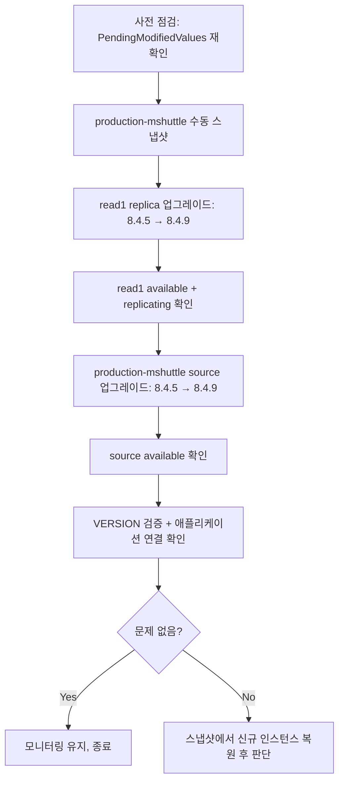

# RDS for MySQL 마이너 버전 인플레이스 업그레이드 (8.4.5 → 8.4.9)

✅ **2026-08-16 실행 완료.** 실제 결과·타임라인은 [[../aws-ops/2026-08-16-rds-mysql-minor-version-upgrade]] 참조. 이 문서는 절차 원본(재사용 가능한 runbook)이며, 아래 "현재 상태" 표는 실행 **전** 기준(8.4.5)으로 남겨둠 — 다음 마이너 버전 지원종료 공지가 오면 이 절차를 재사용하되 대상 버전/현재 상태부터 다시 확인할 것.

AWS Health 공지(2026-10-31 표준 지원 종료 대상: 8.4.5, 8.4.6, 5.7.44-RDS.20250213/0508/0818)에 대응. 계정 실측 결과 `production-mshuttle`, `production-mshuttle-read1` 둘 다 8.4.5로 대상에 해당. 배경 및 결정 경위는 [[../aws-pending#rds-for-mysql-마이너-버전-지원-종료-aws-health-공지-2026-08-14-수신]] 참조.

**목표 버전: 8.4.9.** AWS 요구 최소치는 8.4.8이지만, `dev-mshuttle`이 이미 8.4.9로 장기간 안정 운영된 이력이 있어 그 버전에 맞춤(2026-08-16 사용자 결정 — dev 운영 이력을 검증 근거로 채택).

**방식: 인플레이스** (`modify-db-instance --engine-version`). Blue/Green 대비 준비 시간이 짧아 당일 실행에 적합하다고 판단(2026-08-16 결정). 메이저 버전 변경이 아니라 호환성 리스크는 낮으나, **롤백 수단이 스냅샷 복원뿐**이라는 제약은 감안할 것 (아래 [주의사항] 참조).

---

## 대상 인스턴스 현재 상태 (2026-08-16 기준)

| 항목 | production-mshuttle (source) | production-mshuttle-read1 (replica) |
|---|---|---|
| Engine | MySQL 8.4.5 | MySQL 8.4.5 |
| Class | db.t4g.large | db.t4g.small |
| Storage | 100 GB gp3 | 100 GB gp3 |
| AZ / Multi-AZ | ap-northeast-2c / **단일 AZ** | ap-northeast-2c / **단일 AZ** |
| Parameter Group | `params-production-mysql84` (공유) | `params-production-mysql84` (공유) |
| Option Group | `default:mysql-8-4` | `default:mysql-8-4` |
| Security Group | `sg-a8fee9c1` | `sg-a8fee9c1` |
| Backup Retention | 7일 | 0일 (백업 없음) |
| Maintenance Window | 토 14:20~14:50 UTC (= 토 23:20~23:50 KST) | 동일 |
| Deletion Protection | **true** | false |
| AutoMinorVersionUpgrade | false | false |
| PendingModifiedValues | `{}` (대기 중인 다른 변경 없음, 2026-08-16 확인) | `{}` |
| Publicly Accessible | true | true |

⚠️ `production-mshuttle`은 `DeletionProtection: true` — 이번 절차에선 삭제 안 하니 무관하지만, 실수로 delete 계열 명령이 들어가면 이 보호막이 막아준다는 점만 참고.

⚠️ `PendingModifiedValues`가 비어있음을 실행 직전에 다시 확인할 것 — `--apply-immediately`는 대기 중인 **다른** 변경사항까지 한꺼번에 적용해버림.

---

## 절차 흐름



**순서 이유:** MySQL 복제는 replica가 source보다 낮은 버전이면 깨질 수 있어, replica를 먼저(또는 최소 source와 동시에) 올리는 게 일반적 권장. 여기선 replica → source 순으로 진행.

---

## 사전 준비

### 1) 실행 시간대
오늘밤~내일 새벽, 트래픽 낮은 시간대(2026-08-16 사용자 결정). Preferred Maintenance Window(토 23:20~23:50 KST)와는 무관하게 `--apply-immediately`로 즉시 실행.

### 2) 사전 점검 명령

```bash
REGION=ap-northeast-2

# 대기 중인 변경사항 없는지 재확인 (있으면 apply-immediately 시 같이 적용됨 — 의도한 것인지 확인 필요)
aws rds describe-db-instances --region $REGION \
  --db-instance-identifier production-mshuttle \
  --query "DBInstances[0].PendingModifiedValues"

aws rds describe-db-instances --region $REGION \
  --db-instance-identifier production-mshuttle-read1 \
  --query "DBInstances[0].PendingModifiedValues"

# 현재 연결 수 확인 (낮은 시간대인지 재확인)
aws cloudwatch get-metric-statistics --region $REGION \
  --namespace AWS/RDS --metric-name DatabaseConnections \
  --dimensions Name=DBInstanceIdentifier,Value=production-mshuttle \
  --start-time $(date -u -v-10M +%Y-%m-%dT%H:%M:%S) --end-time $(date -u +%Y-%m-%dT%H:%M:%S) \
  --period 300 --statistics Average
```

### 3) 목표 버전 존재 확인

```bash
aws rds describe-db-engine-versions --region $REGION \
  --engine mysql --engine-version 8.4.9 \
  --query "DBEngineVersions[0].{Version:EngineVersion,Status:Status}"
```

---

## 단계별 절차

### Step 1. production-mshuttle 수동 스냅샷 (롤백 안전망)

```bash
REGION=ap-northeast-2
SNAP_ID=production-mshuttle-pre-8-4-9-upgrade-2026-08-16

aws rds create-db-snapshot --region $REGION \
  --db-instance-identifier production-mshuttle \
  --db-snapshot-identifier $SNAP_ID

# 완료 대기 (스냅샷 생성은 rename 이 아니므로 표준 waiter 사용 가능)
aws rds wait db-snapshot-completed --region $REGION --db-snapshot-identifier $SNAP_ID
```

스냅샷 생성 중에도 인스턴스는 정상 서비스 가능(약간의 I/O 부하만 발생). 100GB 기준 통상 수 분~십수 분.

### Step 2. read replica 업그레이드 (8.4.5 → 8.4.9)

```bash
aws rds modify-db-instance --region $REGION \
  --db-instance-identifier production-mshuttle-read1 \
  --engine-version 8.4.9 \
  --apply-immediately
```

**폴링 (표준 waiter 대신):** identifier가 바뀌는 rename 이 아니므로 [[../gotchas#aws-rds-rename--waiter-notfound-함정]]의 NotFound 함정은 여기 해당 없음 — `aws rds wait db-instance-available` 사용 가능. 다만 상태 변화 과정을 보고 싶으면 아래 폴링 스타일 권장:

```bash
while true; do
  STATUS=$(aws rds describe-db-instances --region $REGION \
    --db-instance-identifier production-mshuttle-read1 \
    --query "DBInstances[0].DBInstanceStatus" --output text)
  echo "$(date '+%H:%M:%S') read1 status: $STATUS"
  [ "$STATUS" = "available" ] && break
  sleep 15
done
```

### Step 3. replica 버전 + 복제 상태 확인

```bash
aws rds describe-db-instances --region $REGION \
  --db-instance-identifier production-mshuttle-read1 \
  --query "DBInstances[0].{Version:EngineVersion,Status:DBInstanceStatus,Replication:StatusInfos}"
```

`EngineVersion: 8.4.9`, `StatusInfos[0].Status: replicating`, `Normal: true` 확인 후 다음 단계로. 여기서 문제 있으면 **source는 아직 손대지 않았으므로 안전하게 중단 가능**.

### Step 4. production-mshuttle (source) 업그레이드 (8.4.5 → 8.4.9)

⚠️ 이 단계에서 실제 다운타임 발생 (단일 AZ라 재부팅 수반, 통상 수 분 — 정확한 시간은 실행해봐야 확인 가능).

```bash
aws rds modify-db-instance --region $REGION \
  --db-instance-identifier production-mshuttle \
  --engine-version 8.4.9 \
  --apply-immediately
```

폴링:

```bash
while true; do
  STATUS=$(aws rds describe-db-instances --region $REGION \
    --db-instance-identifier production-mshuttle \
    --query "DBInstances[0].DBInstanceStatus" --output text)
  echo "$(date '+%H:%M:%S') production-mshuttle status: $STATUS"
  [ "$STATUS" = "available" ] && break
  sleep 15
done
```

### Step 5. 검증

```bash
# 버전 확인
aws rds describe-db-instances --region $REGION \
  --db-instance-identifier production-mshuttle \
  --query "DBInstances[0].EngineVersion"

# 실제 접속해서 VERSION() 확인 (mshuttle EC2 등 VPC 내부에서 권장 — PubliclyAccessible=true 라 외부도 가능)
mysql -h production-mshuttle.cpbnujantp4n.ap-northeast-2.rds.amazonaws.com \
  -u admin -p"<master 비밀번호>" -e "SELECT VERSION();"

mysql -h production-mshuttle-read1.cpbnujantp4n.ap-northeast-2.rds.amazonaws.com \
  -u admin -p"<master 비밀번호>" -e "SELECT VERSION();"

# 복제 재확인
aws rds describe-db-instances --region $REGION \
  --db-instance-identifier production-mshuttle-read1 \
  --query "DBInstances[0].StatusInfos"

# 애플리케이션 연결/에러 로그 확인 (CloudWatch Logs — EnabledCloudwatchLogsExports: audit/error/general/slowquery)
aws logs tail /aws/rds/instance/production-mshuttle/error --region $REGION --since 15m
```

애플리케이션 쪽에서 정상 쿼리/연결이 이루어지는지 몇 분 모니터링.

---

## 롤백 시나리오

⚠️ **이 절차는 rename-swap 방식이 아니라 인플레이스라, `rds-shrink-migration` 처럼 "옛 인스턴스로 즉시 되돌리기"가 불가능.** RDS는 엔진 버전 다운그레이드를 `modify-db-instance`로 지원하지 않음.

문제 발생 시 선택지:
1. **경미한 문제(설정 호환성 등):** 파라미터 그룹/애플리케이션 쪽에서 대응 가능하면 그쪽을 우선 시도.
2. **심각한 문제(데이터/엔진 레벨):** Step 1의 스냅샷(`production-mshuttle-pre-8-4-9-upgrade-2026-08-16`)에서 신규 인스턴스로 복원 후, 전환 여부를 사용자와 재논의. 이 경로는 다운타임이 이번 업그레이드보다 훨씬 크므로 실제 실행 전 반드시 사용자 확인.

```bash
# 복원 예시 (실행 전 반드시 사용자 확인)
aws rds restore-db-instance-from-db-snapshot --region $REGION \
  --db-instance-identifier production-mshuttle-restored \
  --db-snapshot-identifier production-mshuttle-pre-8-4-9-upgrade-2026-08-16
```

---

## 예상 시간

| 단계 | 시간 |
|---|---|
| Step 1. 수동 스냅샷 | 5~15분 (인스턴스는 서비스 유지) |
| Step 2. replica 업그레이드 | 5~15분 (다운타임 아님, replica 자체 재부팅) |
| Step 3. 검증 | 5분 |
| Step 4. source 업그레이드 | 5~15분 (**이 구간이 실제 다운타임**) |
| Step 5. 검증 | 10~15분 (모니터링 포함) |
| **합계** | **약 30분~1시간** |

**실측 (2026-08-16):** 실다운타임은 예상대로 짧았음 — replica 약 2분 37초, source 약 2분 20초. 다만 `DBInstanceStatus`가 `available`로 반영되기까지는 `configuring-enhanced-monitoring`/`modifying`(Monitoring Interval·Performance Insights·파라미터 그룹 재적용) 단계를 거치며 각 Step 2/4가 개별적으로 예상(5~15분)의 2~3배(30~40분) 걸림 — 전체 합계는 위 범위 안에 들었지만 단계별 편차가 컸음. 다음 실행 시 참고. 상세 [[../aws-ops/2026-08-16-rds-mysql-minor-version-upgrade#8-관찰-사항]].

---

## 체크리스트

> 2026-08-16 실행분은 전 항목 완료 — 상세 [[../aws-ops/2026-08-16-rds-mysql-minor-version-upgrade]]. 아래는 재사용 시 체크용 템플릿.

- [ ] 실행 시간대 확인 (오늘밤~내일 새벽, 저트래픽)
- [ ] `PendingModifiedValues` 양쪽 다 빈 상태 재확인
- [ ] Step 1: production-mshuttle 수동 스냅샷 생성 + 완료 대기
- [ ] Step 2: production-mshuttle-read1 → 8.4.9
- [ ] Step 3: replica 버전 + 복제 상태(`replicating`, `Normal: true`) 확인
- [ ] Step 4: production-mshuttle → 8.4.9 (다운타임 구간)
- [ ] Step 5: 양쪽 VERSION() 확인, 애플리케이션 연결/에러 로그 확인
- [ ] 사후 모니터링 (최소 몇 시간, CloudWatch CPU/Connections/에러 로그)
- [ ] `llm-wiki/aws-pending.md`의 이 항목 상태를 완료로 갱신

---

## 주의사항

- **`params-production-mysql84`는 "함부로 변경 금지" 대상** ([[../aws-inventory/protected-resources#5-production-mshuttle-rds-일가족]]). 이번 절차는 파라미터 그룹 자체를 바꾸지 않음(엔진 버전만 변경) — 그대로 유지.
- **`--apply-immediately`는 대기 중인 다른 pending 변경까지 한꺼번에 적용**한다. 사전 점검에서 `PendingModifiedValues`가 비어있음을 확인했지만, 실행 직전에 한 번 더 확인할 것.
- 롤백은 스냅샷 복원뿐이며 이 경우 다운타임이 이번 업그레이드보다 훨씬 커짐 — 실행 전 감안.
- `production-mshuttle-read1`은 `BackupRetentionPeriod: 0`(백업 없음)이라 자체 스냅샷 안전망이 없음. 문제 생기면 source 스냅샷에서 복원 후 replica 재생성.
- 목표 버전 8.4.9는 AWS 요구 최소치(8.4.8)보다 한 단계 위 — dev에서 실사용 검증된 버전이라는 근거로 선택([[../aws-pending#rds-for-mysql-마이너-버전-지원-종료-aws-health-공지-2026-08-14-수신]]). 최신 패치(8.4.10)로 가고 싶다면 이 문서의 버전 문자열만 바꿔 재사용 가능.
- **스냅샷/인스턴스 identifier는 `.`(마침표) 사용 불가** (letters/digits/hyphens만) — 버전 문자열을 identifier에 넣을 때 `8.4.9`가 아니라 `8-4-9`로 쓸 것. [[../gotchas#aws-rds-스냅샷인스턴스-identifier는-마침표-금지]] 참조.
